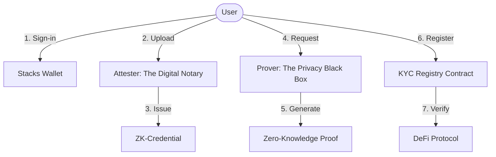
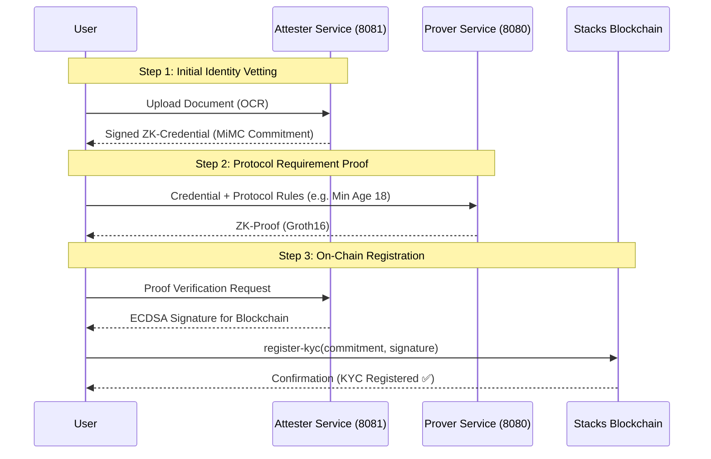

# Noah-v2: Infrastructure for Privacy-Preserving Trust

**Noah-v2** is a decentralized framework for sensitive identity verification on the Stacks blockchain. It enables users to prove they satisfy complex protocol requirements—like age, residency, or accreditation—without ever exposing their raw personal data to the service provider.

---

##  One Mission, Three Specialized Hubs

Noah-v2 is organized into specialized components. Each has its own dedicated documentation to help you dive deep into that specific area.

| Component | Role | Deep Dive |
| :--- | :--- | :--- |
| **Backend** | The "Off-chain Engine" (Attester & Prover services). | [Read Backend Guide](backend/README.md) |
| **SDK** | The "Developer's Toolbelt" for TypeScript/Stacks apps. | [Read SDK Reference](packages/noah-sdk/README.md) |
| **Frontend** | The "Reference Implementation" showing a real user journey. | [Read Frontend Guide](frontend-example/README.md) |

---

##  The Vision: Real-World Privacy

Most KYC systems force a choice: "Give us your data, or get no access." Noah-v2 changes the conversation to: "Prove you qualify, and keep your data."

### Use Case 1: The Compliant DEX
**Problem**: A Decentralized Exchange needs to ensure users are 18+ and not in a sanctioned region.
**Noah-v2 Solution**: Users generate a proof showing they are 18+ in a supported region. The DEX receives a "Verified" status on-chain. The exchange never sees the user's passport or birthdate.

### Use Case 2: Lending & Accreditation
**Problem**: A lending protocol restricts high-yield vaults to accredited investors (e.g., $1M+ net worth).
**Noah-v2 Solution**: Investors provide financial documents to an Attester once. They then generate proofs showing "Net Worth > $1M" to the protocol. The protocol verifies the proof and grants access without knowing the user's exact balance.

### Use Case 3: Reusable Gaming ID
**Problem**: A gaming platform needs to gate content behind 18+ filters but doesn't want the liability of storing identity documents.
**Noah-v2 Solution**: Users reuse their existing on-chain KYC commitment. The platform checks `isKYCValid()` through the SDK, granting instant access with zero data storage.

---

##  High-Level Architecture

Noah-v2 uses a "Double-Signing" architecture to bridge the gap between heavy Zero-Knowledge computation and the Stacks blockchain.



### 1. The Attester (The Digital Notary)
The Attester verifies physical documents (OCR) off-chain and issues a MiMC commitment. It acts as a trusted bridge between the real world and the cryptographic world.

### 2. The Prover (The Privacy Black Box)
The Prover takes the user's private data and protocol-specific rules to generate a Zero-Knowledge Proof (Groth16). It proves the data satisfies the rules without revealing the data itself.

### 3. The KYC Registry (The On-chain Truth)
A Clarity smart contract that stores the user's address, their cryptographic commitment, and the Attester's signature. It allows any protocol to check a user's status in a single contract call.

---

##  The User Journey



---

## 📂 Project Structure

- `circuit/`: Core ZK logic defined in **Go/gnark**.
- `backend/`: Microservices architecture for **Attester** (Signing) and **Prover** (ZK-Gen).
- `packages/noah-sdk/`: The official TypeScript library (`noah-clarity`).
- `kyc-registry/`: **Clarity** smart contracts for the Stacks ecosystem.
- `frontend-example/`: A React + MUI reference application for the end-to-end flow.

---

## 🚀 Quick Start

### Prerequisites
- **Go 1.21+**
- **Node.js 20+**
- **Clarinet** (for smart contract testing)

### Setup & Launch
We use a centralized `Makefile` to manage the workspace.

```bash
# 1. Install all dependencies
make install

# 2. Start the services (requires separate terminals)
make run-prover     # Port 8080
make run-attester   # Port 8081

# 3. Launch the Demo UI
cd frontend-example && npm run dev
```

---

## 🤝 Contributing & Security

Noah-v2 is an open-infrastructure project. We welcome contributions in:
- **ZK Circuits**: Adding new proof types (e.g., proof of employment).
- **Security**: Auditing the MiMC commitment paths.
- **Interoperability**: Connecting with other identity standards.

*Copyright © 2024 Noah-v2 Team. Built for the Stacks ecosystem.*
